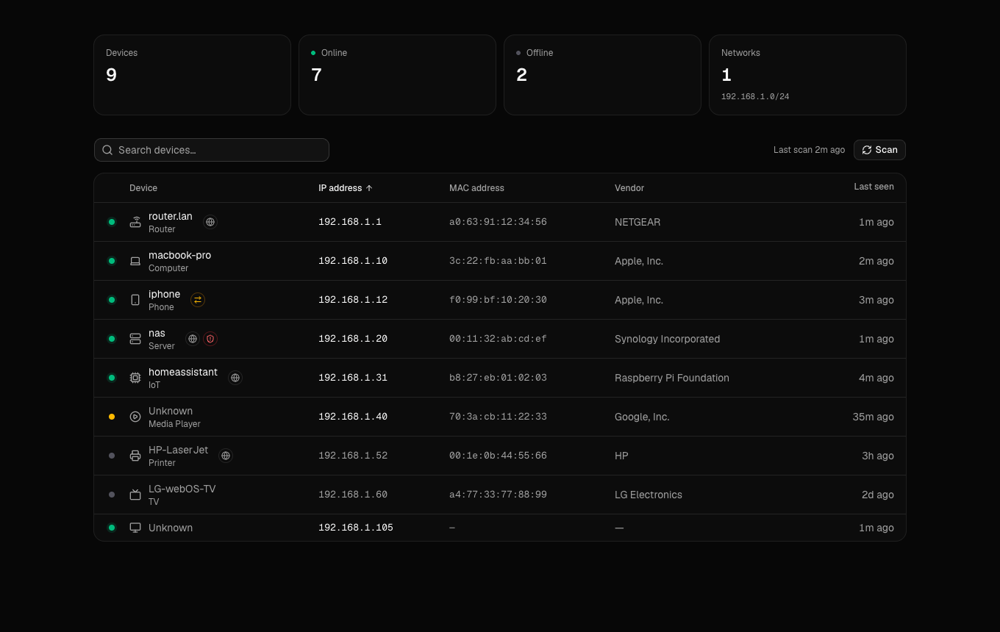

# Scout

A minimal, self-hosted LAN scanner. It runs as one Go binary with an embedded dashboard: stat cards and a device table, with no logins and no settings pages.



Scout is a fork of [LAN Orangutan](https://github.com/291-Group/LAN-Orangutan) by 291 Group. The scanner (nmap, mDNS, NetBIOS, vendor lookup, device classification) comes from upstream. Scout replaces the web UI.

## Run with Docker (Linux)

```yaml
services:
  scout:
    image: ghcr.io/timblazing/scout:latest
    container_name: scout
    restart: unless-stopped
    network_mode: host
    cap_add: [NET_RAW, NET_ADMIN, NET_BIND_SERVICE]
    environment:
      - ORANGUTAN_PORT=291
      - TZ=America/Chicago
    volumes:
      - ./data:/var/lib/lan-orangutan
```

Open `http://<host>:291`. Host networking is required, so this won't work under Docker Desktop on macOS or Windows.

> The dashboard has no authentication. Anyone who can reach the port can see your devices and trigger a scan. Keep it on a trusted network, or put a reverse proxy with auth in front of it.

## Configuration

Configuration comes from environment variables, or from `config.ini` (see `config.example.ini`).

| Variable | Default | |
|---|---|---|
| `ORANGUTAN_PORT` | `291` | HTTP port |
| `ORANGUTAN_BIND_ADDRESS` | `0.0.0.0` | Listen address |
| `ORANGUTAN_NETWORKS` | auto-detect | Extra CIDRs to scan, comma separated |
| `ORANGUTAN_EXCLUDE_NETWORKS` | | CIDRs to skip |
| `ORANGUTAN_ONLY_CONFIGURED_NETWORKS` | `false` | Scan only `ORANGUTAN_NETWORKS` |
| `ORANGUTAN_SCAN_INTERVAL` | `300` | Seconds between background scans |
| `ORANGUTAN_CONTINUOUS_SCAN` | `true` | Rescan in the background |
| `ORANGUTAN_ENABLE_SERVICE_DETECTION` | `false` | Probe ports to flag web UIs and risky services |
| `ORANGUTAN_DATA_DIR` | `/var/lib/lan-orangutan` | Device and scan history |

The `ORANGUTAN_*` names and the data path are kept from upstream, so an existing LAN Orangutan data directory works unchanged.

## Development

The project needs Go 1.25+, Node 22+, and nmap.

```sh
make web                              # build the dashboard into internal/web/dist
go run ./cmd/orangutan serve          # serve it on :291 (sudo for ARP/MACs)

make web-dev                          # hot-reloading UI on :5173, proxies /api to :291
SCOUT_API=http://10.0.0.5:291 make web-dev   # or proxy to a remote instance
```

| Path | Contents |
|---|---|
| `web/` | Vite + React + TypeScript + Tailwind v4 + shadcn/ui |
| `internal/web/` | Embeds and serves the built dashboard |
| `internal/api/` | JSON API; the dashboard polls `/api/overview` and posts to `/api/scan/start` |
| `internal/scanner/`, `internal/network/` | Discovery (upstream) |

## Releasing

Push a `v*` tag. The release workflow builds binaries and publishes a multi-arch image to `ghcr.io/<owner>/scout`. After the first publish, set the package to public under GitHub → Packages → scout → Settings, or run `docker login ghcr.io` on the host.

## License

MIT. See [LICENSE](LICENSE). Original work © 291 Group.
